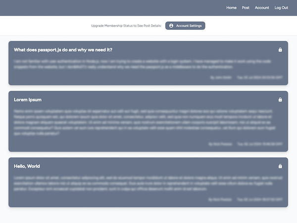

# Members Only App

This members only app is an online forum where only members can view post details and create new posts while only admins can delete posts. Users can sign up for an account, log in and out, and update account details such as first name, last name, membership status, admin status, and password. To change membership and admin status and to delete posts, users must input the correct member and admin passwords.

The frontend of this application is built with EJS, JavaScript, and Tailwind CSS, and the backend is built with Node.js, Express, MongoDB, and Mongoose. Authentication is powered by Passport.js and secured by bcryptjs, and all forms are validated with express-validator.

    <a href="">
        
        </img>
    </a>

## Technologies Used

### Front End

    <li style="margin: auto">
        
        HTML
    </li>
    <li style="margin: auto">
        
        Embedded JavaScript Templates
    </li>
    <li>
        
        JavaScript
    </li>
    <li>
        
        Tailwind CSS
    </li>

### Back End

    <li>
        
        Node.js
    </li>
        <li>
        
        Express
    </li>
    <li>
        
        MongoDB
    </li>
    <li>
        
        Mongoose
    </li>
    <li>
        
        Passport.js
    </li>
        <li>
        
        express-validator
    </li>

## Live Demo

View a live demo [here]().
